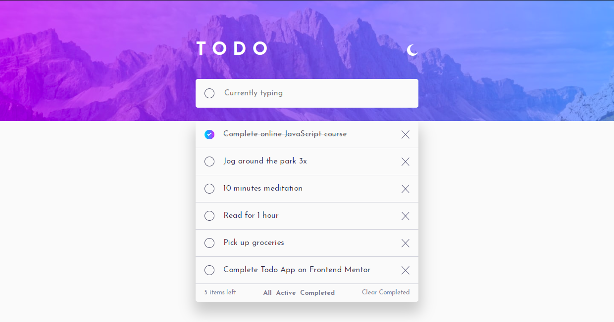

# Frontend Mentor - Todo app solution

This is a solution to the [Todo app challenge on Frontend Mentor](https://www.frontendmentor.io/challenges/todo-app-Su1_KokOW).

## Table of contents

- [Overview](#overview)
  - [Screenshot](#screenshot)
  - [The challenge](#the-challenge)
  - [Links](#links)
- [My process](#my-process)
  - [Built with](#built-with)
  - [Useful resources](#useful-resources)
- [Acknowledgments](#acknowledgments)
  - [Author](#author)
  - [Installation](#installation)


## Overview

### Screenshot



### The challenge

Users should be able to:

- View the optimal layout for the app depending on their device's screen size
- See hover states for all interactive elements on the page
- Add new todos to the list
- Mark todos as complete
- Delete todos from the list
- Filter by all/active/complete todos
- Clear all completed todos
- Toggle light and dark mode
- **Bonus**: Drag and drop to reorder items on the list

### Links

- Solution URL: [-](https://your-solution-url.com)
- Live Site URL: [-](https://your-live-site-url.com)


## My process

### Built with


- HTML5
- CSS
- Flexbox
- JavaScript
- React - JS library


### Useful resources

- [Use Local Storage](https://youtu.be/uutiLsX5kFE) - This is an good video that helped me make the code to save the data in the Local Storage. I'd recommend it to anyone still learning this concept.

## Author

- Frontend Mentor - [@FatimaGR](https://www.frontendmentor.io/profile/FatimaGR)

## Acknowledgments
### Installation
Run the following commands:
```
npm install
```
### Running the app
```
npm start
```
To view it open http://localhost:3000